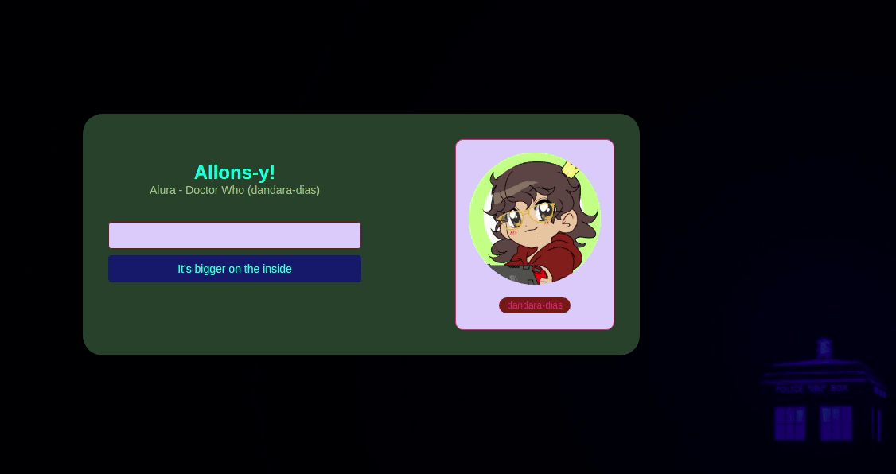
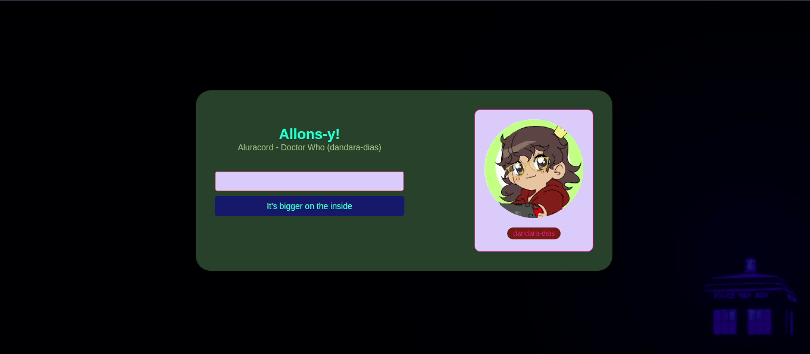
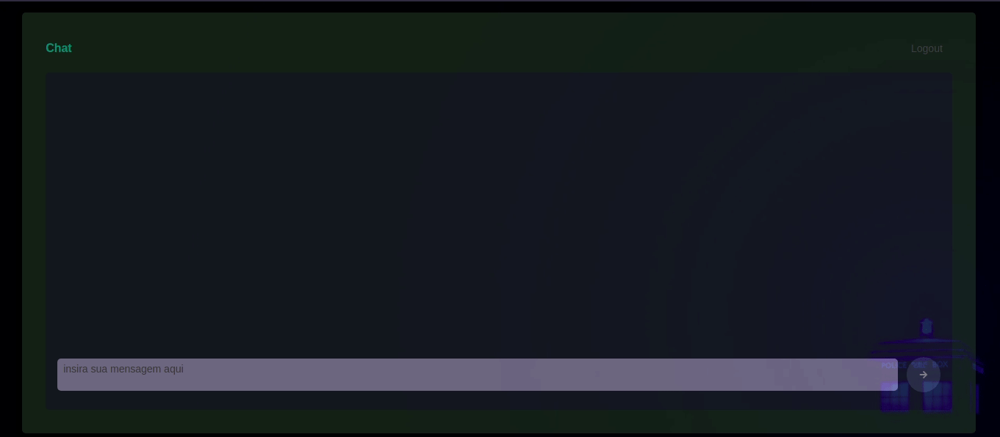
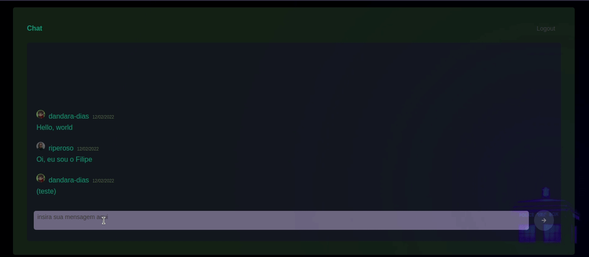

# Imersão React 4

Este repositório contém todas as atividades de aprendizagem desenvolvidas por <a href="https://www.linkedin.com/in/dandara-dias/">Dandara Dias</a> durante o evento da <a href="https://www.alura.com.br/imersao-react">Alura</a> 

A Imersão React da Alura é para quem quer expandir o seu conhecimento em JavaScript ao desenvolver projetos de front-end utilizando o React como principal ferramenta. 

Durante a imersão, vamos desenvolver um novo projeto com Next.js, aplicar conceitos gerais em novos desafios, utilizar componentes do React como JSX, useState e useEffect, e adquirir maior autonomia como front-end, entendendo conceitos fundamentais, não apenas bibliotecas.

  
Aula 1

  
  Na primeira aula de React, começamos a desenvolver uma área de login no Aluracord (inspirado no Discord). Criamos desde o package.json até os arquivos bases do Next.js para iniciar nosso projeto, além de ter o CSS-in-JS com styled-jsx para cuidar da camada de estilo da nossa aplicação.
  
  Também foi possível customizar o Aluracord, escolhendo um tema da nossa preferência entre filmes, séries, esportes, desenhos etc. Nesse caso, o tema escolhido foi a série britânica Doctor Who, da BBC.
  
  Por fim, foi feito o deploy do Aluracord na <a href="https://alura-doctor-who.vercel.app/">Vercel</a>.
  
  

  
  

  
Aula 2

  
  Na segunda aula, aprendemos a lidar com o state do React e como trabalhar com eventos como onClick e onSubmit. Na página de login, agora é possível escrever o nome do usuário do GitHub para entrar no chat. Também demos início a página de chat, ainda sem muitas personalizações.
  
  Como detalhes adicionais, o nome e foto de usuário são alterados automaticamente na área ao lado do formulário, onde o nome também conta com um link para o perfil real do GitHub.
  
  Por fim, foi feito o deploy do Aluracord na <a href="https://alura-doctor-who.vercel.app/">Vercel</a>.
  
  

  
  

  
Aula 3

  
  Na terceira aula, criamos e estilizamos a estrutura do chat e fizemos ele funcionar inicialmente sem nenhum Back-End. Entendemos um pouco mais de como podemos trabalhar com state no React e criamos um campo que ao apertarmos o Enter no teclado, envia a mensagem para o chat.
  
  Como detalhe adicional, também foi criado um botão para a mensagem ser enviada clicando.
  
  Por fim, foi feito o deploy do Aluracord na <a href="https://alura-doctor-who.vercel.app/">Vercel</a>.
  
  

  
  

  
Aula 4

  
  Na quarta aula, aprendemos a utilizar o <a href="https://app.supabase.io/">Supabase</a>, uma ferramenta <i>Back-end as a Service</i>, a fim de termos um banco de dados <i>real time</i> que guarda as mensagens do chat.
  
  Como detalhe adicional, ao clicar na foto da pessoa que enviou a mensagem no chat, é aberta uma janela com informações do seu usuário do GitHub, bem como um link para seu perfil no username.
  
  Por fim, foi feito o deploy do Aluracord na  <a href="https://alura-doctor-who.vercel.app/">Vercel</a>.
  
  

  
  

